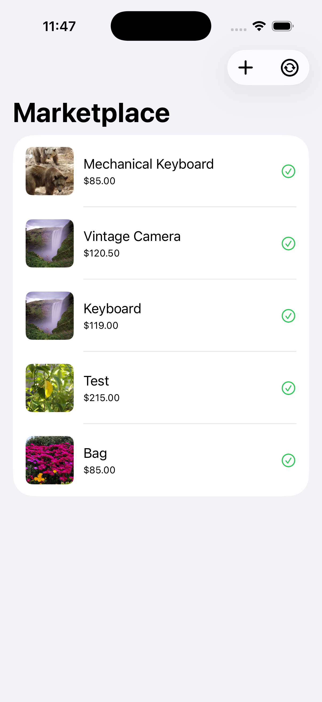
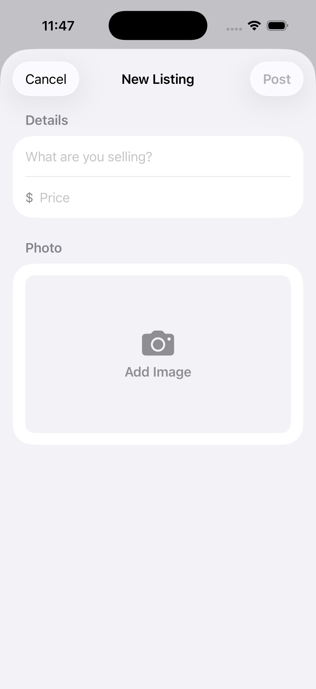
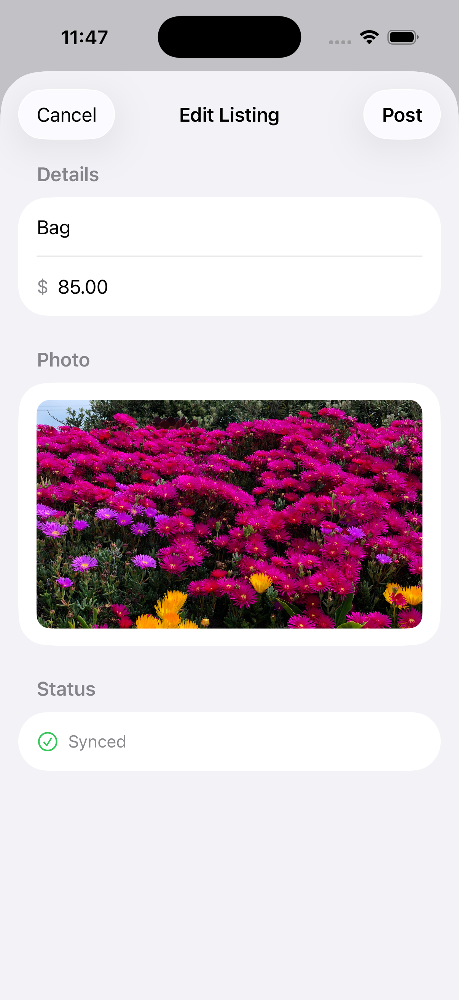
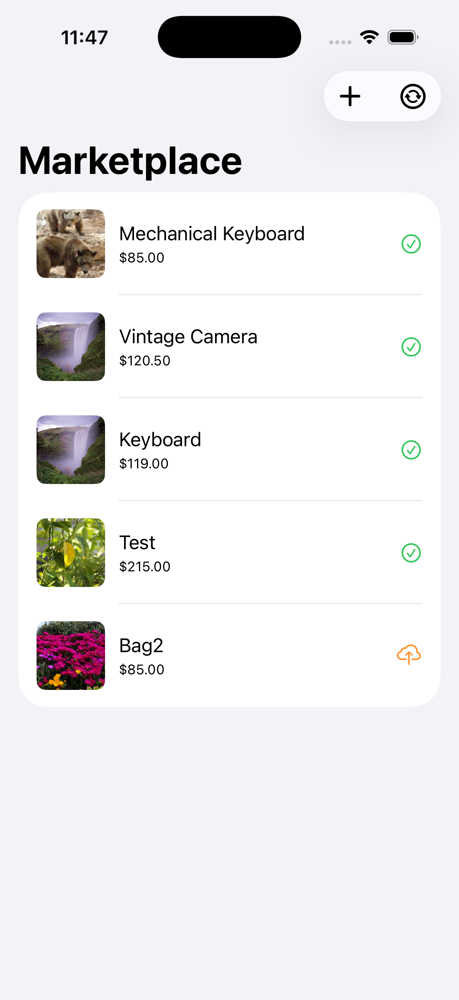
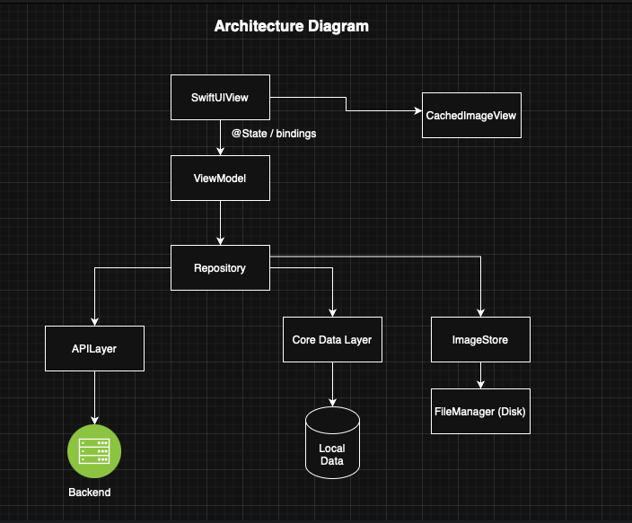

# 🛒 Marketplace App

A SwiftUI-based marketplace app built with MVVM + CoreData.

---

## ✨ Features

- Create & edit listings
- Image picker integration
- Offline sync support
- Core Data persistence

---

## 📱 Screenshots

### 🏠 Home Screen

### ➕ Create Listing

### 📦 Listing Detail

### 🔄 Sync Status

---

## 🧱 Architecture

- SwiftUI + MVVM
- Repository Pattern
- Core Data storage
- UIKit bridge for image picker

### 📈 Architecture Diagram

